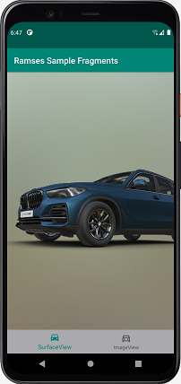

# Ramses sample app

This application demonstrates the usage of the [Ramses rendering engine](https://ramses-sdk.readthedocs.io/en/latest/index.html) alongside
a 3D vehicle model of a BMW X5 (2018). The application is written in Kotlin and
the vehicle resource is built using the [Ramses Composer](https://github.com/bmwcarit/ramses-composer) GUI
v0.13.1. You can find a modifiable project with the car [on Github](https://github.com/bmwcarit/digital-car-3d).

If you want to build the app and experiment with the code you need a Github personal access token (PAT).
The PAT is needed to fetch the Ramses Maven packages from the Github Packages registry.
For further information how to create a Github PAT, take a look at the [githubs guide](https://docs.github.com/en/authentication/keeping-your-account-and-data-secure/creating-a-personal-access-token).
To fetch packages, the token needs the 'read:packages' permission only.

Now you only need to use the PAT for this repo.
For this to work just uncomment line 18 and 19 in the [gradle.properties file](./gradle.properties) and substitute the two strings "USERNAME" and
"GH_PERSONAL_ACCESS_TOKEN" with your github username and the github personal access token. Be careful to
not commit these credentials anywhere, the Github token is attributed to you and should not be given to
others or shared.

If everything worked, you should see a 3D car as the first of two navigable fragments:

The first fragment shows a surface with 3D view of a BMW X5 model. The second fragment shows a static
logo image. It is possible to mix Ramses 3D content with other Android UI elements in various
ways. Be creative!

# License

The application source code is under the [MPL 2.0 license](./LICENSE.txt), the same license as the Ramses AAR,
Ramses itself and the Ramses Logic.

The digital car model is licensed under CC-BY-4.0 (see [the source repository](https://github.com/bmwcarit/digital-car-3d)).

The binary files of the digital car model that are located in the apps [asset folder](./app/src/main/assets) are also licensed under CC-BY-4.0 (see [the source repository](https://github.com/bmwcarit/digital-car-3d)).
